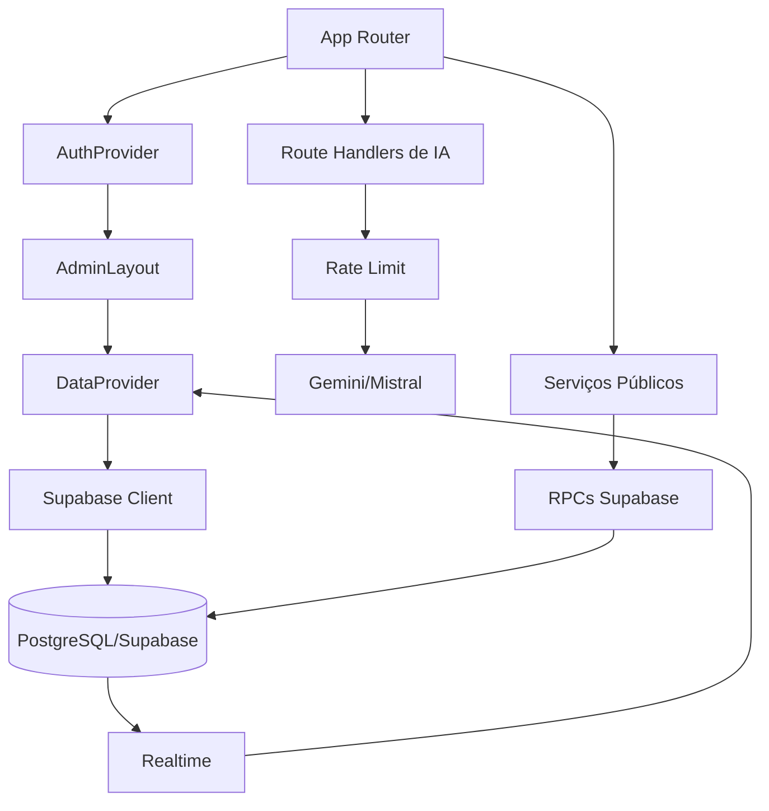
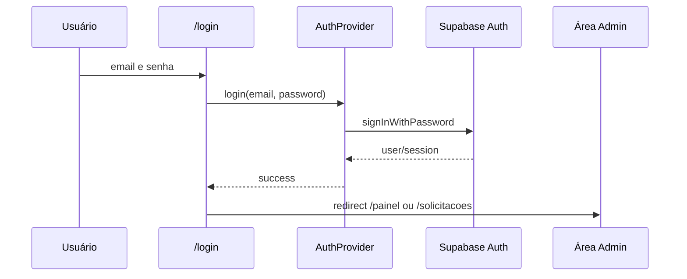

# IGE Almoxarifado

**Documentação Técnica Completa do Projeto**

| Campo | Informação |
| --- | --- |
| Projeto | IGE Almoxarifado / Sistema Interno de Operações |
| Empresa | IGE / Supergesso |
| Versão | 0.3.0 |
| Data | 02/07/2026 |
| Tecnologias | Next.js, React, JavaScript, TypeScript em componentes UI, Tailwind CSS, Supabase, PWA, Service Worker, FullCalendar, Recharts, IA Gemini/Mistral, npm |

## Sumário

1. [Apresentação](#1-apresentação)
2. [Arquitetura Geral](#2-arquitetura-geral)
3. [Estrutura de Pastas](#3-estrutura-de-pastas)
4. [Tecnologias](#4-tecnologias)
5. [Dependências](#5-dependências)
6. [Variáveis de Ambiente](#6-variáveis-de-ambiente)
7. [Banco de Dados](#7-banco-de-dados)
8. [Supabase](#8-supabase)
9. [Rotas](#9-rotas)
10. [Páginas](#10-páginas)
11. [Componentes](#11-componentes)
12. [Hooks](#12-hooks)
13. [Services](#13-services)
14. [Funções Importantes](#14-funções-importantes)
15. [APIs](#15-apis)
16. [Inteligência Artificial](#16-inteligência-artificial)
17. [Inventário](#17-inventário)
18. [Compras](#18-compras)
19. [Catálogo](#19-catálogo)
20. [Segurança](#20-segurança)
21. [Performance](#21-performance)
22. [PWA](#22-pwa)
23. [Fluxos do Sistema](#23-fluxos-do-sistema)
24. [Regras de Negócio](#24-regras-de-negócio)
25. [Guia para Desenvolvedores](#25-guia-para-desenvolvedores)
26. [Problemas Conhecidos](#26-problemas-conhecidos)
27. [Glossário](#27-glossário)
28. [Conclusão](#28-conclusão)

## 1. Apresentação

O projeto é um sistema interno da IGE / Supergesso criado para apoiar rotinas administrativas, operacionais, compras e almoxarifado em uma única aplicação web.

O sistema resolve o problema de controles paralelos de compras, estoque, contagem física, tarefas e lembretes, centralizando os dados no Supabase e distribuindo as informações por telas específicas para operação diária.

### Público-alvo

- Colaboradores que precisam abrir solicitações de compra.
- Equipe administrativa responsável por compras, cotações, pedidos e recebimentos.
- Equipe de almoxarifado responsável por produtos, estoque, entradas, saídas e etiquetas.
- Equipe interna que acompanha tarefas, lembretes, calendário e painel operacional.

### Principais funcionalidades

- Abertura pública de solicitações de compra.
- Consulta pública de andamento por código, produto ou solicitante.
- Catálogo público de materiais sem exposição do estoque atual.
- Login administrativo com Supabase Auth.
- Painel operacional em slides.
- Gestão de tarefas e lembretes.
- Calendário integrado com tarefas e lembretes.
- Gestão de inventário e movimentações de estoque.
- Leitura de código de barras e assistência por imagem.
- Impressão de etiquetas.
- Importação e exportação de produtos.
- Gestão de solicitações, cadastros de solicitantes e centros de custo.
- Entrada em estoque a partir de solicitações concluídas.
- Contagem física por imagens com apoio de IA.
- Análise de giro com gráficos e recomendações por IA/fallback local.

## 2. Arquitetura Geral

A aplicação usa **Next.js App Router**. As telas são implementadas majoritariamente como componentes client-side e consomem Supabase pelo cliente JavaScript. As integrações com IA ficam em route handlers do próprio Next.js, sob `app/(admin)/api`.

O estado administrativo compartilhado fica em `contexts/data-context.js`, que centraliza carregamento inicial, CRUD, atualização local, rollback parcial e assinaturas realtime. A autenticação fica em `contexts/auth-context.js`, baseada em Supabase Auth.

### Visão em camadas

| Camada | Local | Responsabilidade |
| --- | --- | --- |
| Roteamento | `app/` | Páginas públicas, layout global, layout administrativo e APIs internas. |
| Autenticação | `contexts/auth-context.js` | Sessão, login, logout e revalidação. |
| Estado administrativo | `contexts/data-context.js` | Dados de tarefas, lembretes, produtos, movimentações, solicitações, solicitantes e centros de custo. |
| Serviços | `lib/services/` | Normalização, validação, cache e chamadas Supabase/RPC. |
| Componentes | `components/` | Interface por domínio e componentes UI reutilizáveis. |
| Banco | `database/` | Schema SQL, índices, triggers, funções, grants, RLS e policies. |
| IA | `lib/server/ai-providers.js` e `app/(admin)/api/*` | Chamadas Gemini/Mistral, cache, retry, fallback e endpoints. |
| PWA | `public/manifest.json`, `public/sw.js`, `components/pwa/PwaRegister.js` | Manifest, cache offline parcial e registro do service worker. |

### Fluxo de aplicação

```text
Usuário público
  ↓
/solicitar ou /catalogo-publico
  ↓
Serviços públicos
  ↓
RPC Supabase security definer
  ↓
Tabelas públicas com resposta limitada

Usuário administrativo
  ↓
/login
  ↓
Supabase Auth
  ↓
AdminLayout
  ↓
DataProvider
  ↓
CRUD Supabase + Realtime
  ↓
Telas administrativas
```

### Comunicação entre módulos



### Autenticação



## 3. Estrutura de Pastas

| Pasta/arquivo | Responsabilidade |
| --- | --- |
| `app/` | Rotas do App Router, páginas públicas, grupo administrativo e APIs. |
| `app/(admin)/` | Área administrativa protegida pelo layout client-side. |
| `app/(admin)/api/` | Endpoints internos de IA e análise. |
| `components/` | Componentes React de domínio e biblioteca UI. |
| `components/ui/` | Componentes reutilizáveis baseados em Radix/shadcn e utilitários visuais. |
| `components/inventory/` | Tabela de produtos, formulário, scanner, etiquetas e import/export. |
| `components/solicitacoes/` | Formulário, tabela, filtros, badges, detalhes e cadastros de compras. |
| `components/catalogo/` | Header, filtros, preview e cards de resumo do catálogo. |
| `components/contagem/` | Captura de câmera, galeria e lista de produtos contados. |
| `components/slides/` | Slides usados no painel operacional. |
| `components/events/` | Formulário compartilhado por tarefas, lembretes e calendário. |
| `components/layout/` | Sidebar administrativa. |
| `components/pwa/` | Registro do service worker. |
| `constants/` | Opções e regras de status/prioridade. |
| `contexts/` | Contextos de autenticação e dados. |
| `database/` | SQL principal e scripts de auditoria/hardening Supabase. |
| `docs/` | Documentação técnica versionada. |
| `hooks/` | Hooks globais de UI/toast/mobile. |
| `lib/` | Serviços, utilitários, cache, data, exportação, IA, logging e Supabase client. |
| `public/` | Manifest, service worker, logo e ícones. |
| `scripts/` | Script de auditoria Supabase pública. |
| `styles/` | CSS global complementar. |
| `tests/` | Testes/auditorias smoke e contrato. |

## 4. Tecnologias

| Tecnologia | Finalidade | Onde é utilizada | Motivo da escolha |
| --- | --- | --- | --- |
| Next.js | Framework web, App Router, build e route handlers. | `app/`, `next.config.mjs` | Estrutura integrada para UI e APIs. |
| React | Construção da interface. | `app/`, `components/`, `contexts/` | Componentização declarativa. |
| JavaScript | Linguagem principal da aplicação. | Maioria dos arquivos `.js`. | Ecossistema direto do Next/React. |
| TypeScript | Tipagem em componentes UI. | `components/ui/*.tsx`, hooks TS. | Tipagem de wrappers e componentes base. |
| Tailwind CSS | Estilização utilitária. | Classes em componentes, `globals.css`. | Padronização visual e velocidade. |
| Supabase | Auth, banco, RPC e realtime. | `lib/supabase/client.js`, contexts, services, SQL. | Backend gerenciado com PostgreSQL, RLS e realtime. |
| PWA | Manifest, instalação e cache parcial. | `public/manifest.json`, `public/sw.js`. | Melhor experiência de uso recorrente. |
| Service Worker | Cache de navegação e assets. | `public/sw.js`. | Suporte offline parcial e atualização controlada. |
| FullCalendar | Calendário operacional. | `/calendario`, slides. | Biblioteca pronta para visualização de calendário. |
| Recharts | Gráficos da análise de giro. | `/analise-giro`. | Visualização simples de entradas e saídas. |
| Gemini/Mistral | IA para imagens, scanner e giro. | `lib/server/ai-providers.js`. | Automatizar leitura visual e recomendações. |
| ESLint | Qualidade estática. | `npm run lint`. | Padronização e detecção de problemas. |
| npm | Gerenciador de dependências/scripts. | `package.json`. | Fluxo padrão do projeto. |
| Vercel Analytics | Analytics. | Dependência `@vercel/analytics`. | Dependência identificada; uso direto não identificado durante a análise do código. |

## 5. Dependências

As dependências abaixo foram identificadas em `package.json`.

| Biblioteca | Finalidade | Exemplo/uso identificado |
| --- | --- | --- |
| `@fullcalendar/core`, `@fullcalendar/daygrid`, `@fullcalendar/interaction`, `@fullcalendar/react`, `@fullcalendar/timegrid` | Calendário visual com visão mensal e interações. | `app/(admin)/calendario/page.js`. |
| `@hookform/resolvers`, `react-hook-form` | Formulários e integração com validação. | `app/(admin)/inventario/page.js`, formulários. |
| `@radix-ui/*` | Primitivos acessíveis para componentes UI. | `components/ui/*.tsx`. |
| `@supabase/supabase-js` | Cliente Supabase para Auth, banco, RPC e realtime. | `lib/supabase/client.js`, contexts, services. |
| `@vercel/analytics` | Analytics Vercel. | Uso direto não identificado durante a análise do código. |
| `@zxing/browser` | Leitura de código de barras no navegador. | Componente de scanner. |
| `autoprefixer`, `postcss`, `@tailwindcss/postcss` | Pipeline CSS. | Configurações PostCSS/Tailwind. |
| `class-variance-authority`, `clsx`, `tailwind-merge` | Composição e variantes de classes. | `lib/utils.js`, componentes UI. |
| `cmdk` | Command menu. | Componente UI `command.tsx`. |
| `date-fns` | Operações de data. | Utilitários e componentes de data. |
| `embla-carousel-react` | Carrossel. | `components/ui/carousel.tsx`. |
| `framer-motion` | Animações. | `app/not-found.js`. |
| `input-otp` | Input OTP. | `components/ui/input-otp.tsx`. |
| `jsbarcode`, `react-barcode` | Geração/renderização de código de barras. | Impressão de etiquetas. |
| `lucide-react` | Ícones. | Botões, menus e títulos. |
| `next`, `react`, `react-dom` | Base da aplicação. | Todo o projeto. |
| `next-themes` | Tema. | `components/providers/theme-provider.tsx`. |
| `react-day-picker` | Calendário/date picker. | `components/ui/calendar.tsx`. |
| `react-resizable-panels` | Painéis redimensionáveis. | `components/ui/resizable.tsx`. |
| `recharts` | Gráficos. | `app/(admin)/analise-giro/page.js`. |
| `sonner` | Toasts. | Layout global e várias telas. |
| `vaul` | Drawer. | `components/ui/drawer.tsx`. |
| `xlsx` | Importação/exportação de planilhas. | `lib/export/excel.js`, inventário e solicitações. |
| `zod` | Validação de schemas. | Dependência presente; uso específico não identificado durante a análise do código. |
| `eslint`, `eslint-config-next`, `typescript`, `@types/*`, `tailwindcss`, `tw-animate-css` | Desenvolvimento, lint, tipagem e estilos. | Scripts e componentes UI. |

## 6. Variáveis de Ambiente

Valores sensíveis não devem ser versionados. Esta seção lista apenas nomes identificados.

| Variável | Obrigatória | Finalidade | Impacto |
| --- | --- | --- | --- |
| `NEXT_PUBLIC_SUPABASE_URL` | Sim | URL pública do projeto Supabase. | Sem ela, `lib/supabase/client.js` lança erro e a aplicação fica indisponível. |
| `NEXT_PUBLIC_SUPABASE_ANON_KEY` | Sim | Chave pública anon do Supabase. | Sem ela, o cliente Supabase não inicializa. |
| `GEMINI_API_KEYS` | Condicional | Lista de chaves Gemini separadas por vírgula. | Sem ela, fluxos de imagem dependem do fallback Mistral. |
| `GEMINI_API_KEY_1` | Condicional | Chave Gemini alternativa. | Usada para compor lista de chaves se `GEMINI_API_KEYS` não existir. |
| `GEMINI_API_KEY_2` | Condicional | Segunda chave Gemini alternativa. | Usada para rotação. |
| `MISTRAL_API_KEY` | Condicional | Chave do provedor Mistral. | Sem ela, IA de texto/fallback pode falhar. |
| `NODE_ENV` | Automática | Define ambiente de execução. | Controla CSP e registro do service worker. |

## 7. Banco de Dados

O banco usa PostgreSQL/Supabase. O arquivo principal analisado é `database/schema_original_atual.sql`.

### Extensões

```sql
create extension if not exists pgcrypto;
```

### Tabela `tarefas`

Finalidade: itens operacionais internos.

| Coluna | Tipo / constraint |
| --- | --- |
| `id` | `uuid primary key default gen_random_uuid()` |
| `user_id` | `uuid references auth.users(id) on delete set null` |
| `titulo` | `text not null` |
| `descricao` | `text` |
| `responsavel` | `text` |
| `status` | `text not null default 'a_fazer'` |
| `prioridade` | `text not null default 'medio'` |
| `data` | `date` |
| `created_at` | `timestamptz not null default now()` |
| `updated_at` | `timestamptz not null default now()` |

Índice: `tarefas_created_at_idx` em `created_at desc`.

Trigger: `trg_tarefas_updated_at` executa `set_updated_at()`.

RLS: habilitada. Policy `Authenticated users can manage tasks` permite `all` para `authenticated`.

### Tabela `lembretes`

Finalidade: lembretes administrativos.

| Coluna | Tipo / constraint |
| --- | --- |
| `id` | `uuid primary key default gen_random_uuid()` |
| `user_id` | `uuid references auth.users(id) on delete set null` |
| `titulo` | `text not null` |
| `conteudo` | `text` |
| `destinatario` | `text` |
| `status` | `text not null default 'a_fazer'` |
| `prioridade` | `text not null default 'medio'` |
| `data` | `date` |
| `created_at` | `timestamptz not null default now()` |
| `updated_at` | `timestamptz not null default now()` |

Índice: `lembretes_created_at_idx`.

Trigger: `trg_lembretes_updated_at`.

RLS: policy `Authenticated users can manage reminders`.

### Tabela `produtos`

Finalidade: cadastro de materiais e saldos de estoque.

| Coluna | Tipo / constraint |
| --- | --- |
| `id` | `uuid primary key default gen_random_uuid()` |
| `user_id` | `uuid references auth.users(id) on delete set null` |
| `cod` | `text not null unique` |
| `nome` | `text not null` |
| `cod_barra` | `text` |
| `categoria` | `text` |
| `aplicacao` | `text` |
| `medidas` | `text` |
| `marcas` | `text` |
| `img_url` | `text` |
| `estoque` | `numeric not null default 0` |
| `min` | `numeric not null default 0` |
| `max` | `numeric not null default 0` |
| `created_at` | `timestamptz not null default now()` |
| `updated_at` | `timestamptz not null default now()` |

Índices: `produtos_nome_idx`, `produtos_cod_barra_idx`.

Trigger: `trg_produtos_updated_at`.

RLS: policy `Authenticated users can manage products`.

### Tabela `movimentacoes_estoque`

Finalidade: histórico de entradas e saídas.

| Coluna | Tipo / constraint |
| --- | --- |
| `id` | `uuid primary key default gen_random_uuid()` |
| `user_id` | `uuid references auth.users(id) on delete set null` |
| `produto_id` | `uuid references public.produtos(id) on delete set null` |
| `tipo` | `text not null check (tipo in ('entrada', 'saida'))` |
| `quantidade` | `numeric not null check (quantidade > 0)` |
| `motivo` | `text` |
| `created_at` | `timestamptz not null default now()` |

Índice: `movimentacoes_estoque_produto_idx` em `(produto_id, created_at desc)`.

RLS: policy `Authenticated users can manage stock movements`.

### Tabela `centros_custo`

Finalidade: centros de custo usados por compras.

| Coluna | Tipo / constraint |
| --- | --- |
| `id` | `uuid primary key default gen_random_uuid()` |
| `nome` | `text not null` |
| `codigo` | `text unique` |
| `ativo` | `boolean not null default true` |
| `created_at` | `timestamptz not null default now()` |
| `updated_at` | `timestamptz not null default now()` |

Índice: `centros_custo_nome_idx`.

Trigger: `trg_centros_custo_updated_at`.

RLS:

- `Public can read active cost centers`: leitura pública apenas quando `ativo = true`.
- `Authenticated users can manage cost centers`: gestão completa para autenticados.

### Tabela `solicitantes_compra`

Finalidade: solicitantes vinculados a centros de custo.

| Coluna | Tipo / constraint |
| --- | --- |
| `id` | `uuid primary key default gen_random_uuid()` |
| `nome` | `text not null` |
| `centro_custo_id` | `uuid references public.centros_custo(id) on delete set null` |
| `ativo` | `boolean not null default true` |
| `created_at` | `timestamptz not null default now()` |
| `updated_at` | `timestamptz not null default now()` |

Índices: `solicitantes_compra_nome_idx`, `solicitantes_compra_centro_custo_idx`.

Trigger: `trg_solicitantes_compra_updated_at`.

RLS:

- `Public can read active requesters`: leitura pública apenas quando `ativo = true`.
- `Authenticated users can manage requesters`: gestão completa para autenticados.

### Tabela `solicitacoes_compra`

Finalidade: pedidos/solicitações de compra.

| Coluna | Tipo / constraint |
| --- | --- |
| `id` | `uuid primary key default gen_random_uuid()` |
| `codigo` | `text unique` |
| `user_id` | `uuid references auth.users(id) on delete set null` |
| `produto_id` | `uuid references public.produtos(id) on delete set null` |
| `solicitante_id` | `uuid not null references public.solicitantes_compra(id) on delete restrict` |
| `centro_custo_id` | `uuid references public.centros_custo(id) on delete set null` |
| `nome_item` | `text not null` |
| `descricao` | `text` |
| `quantidade` | `numeric not null default 1 check (quantidade > 0)` |
| `prioridade` | `text not null default 'media'` |
| `status_geral` | `text not null default 'nova'`, limitado aos status do fluxo de compras |
| `valor_unitario` | `numeric` |
| `valor_total` | `numeric` |
| `data_solicitacao` | `timestamptz not null default now()` |
| `previsao_desejada` | `date` |
| `previsao_entrega` | `date` |
| `aplicacoes` | `text` |
| `link_referencia` | `text` |
| `fornecedor_nome` | `text` |
| `fornecedor_contato` | `text` |
| `visivel_publico` | `smallint not null default 0 check (visivel_publico in (0, 1))` |
| `created_at` | `timestamptz not null default now()` |
| `updated_at` | `timestamptz not null default now()` |

Índices:

- `solicitacoes_compra_status_idx`
- `solicitacoes_compra_prioridade_idx`
- `solicitacoes_compra_created_at_idx`
- `solicitacoes_compra_visivel_publico_idx`

Sequence: `solicitacoes_compra_codigo_seq`.

Trigger: `trg_solicitacao_compra_codigo`, executando `set_solicitacao_compra_codigo()`.

RLS:

- `Authenticated users can create purchase requests`.
- `Authenticated users can manage purchase requests`.

### Funções SQL

| Função | Finalidade |
| --- | --- |
| `set_updated_at()` | Atualiza `updated_at` antes de updates. |
| `set_solicitacao_compra_codigo()` | Gera `codigo` sequencial com 6 dígitos e atualiza `updated_at`. |
| `criar_solicitacao_compra_publica(...)` | Cria solicitação pública com validações e retorno limitado. |
| `buscar_solicitacao_compra_publica(text)` | Consulta uma solicitação pública por código, apenas se `visivel_publico = 1`. |
| `listar_solicitacoes_compra_publica()` | Lista até 100 solicitações públicas visíveis. |
| `listar_produtos_catalogo_publico()` | Lista produtos do catálogo sem expor estoque atual. |

### Grants

- `anon` e `authenticated` recebem `usage` no schema `public`.
- `anon` pode selecionar solicitantes e centros de custo ativos via policies.
- `authenticated` recebe `select, insert, update, delete` nas tabelas.
- RPCs públicas são concedidas a `anon` e `authenticated`.

### Realtime

Tabelas adicionadas à publicação `supabase_realtime`:

- `tarefas`
- `lembretes`
- `produtos`
- `movimentacoes_estoque`
- `solicitacoes_compra`
- `solicitantes_compra`
- `centros_custo`

### Views

Não identificado durante a análise do código.

## 8. Supabase

### Autenticação

Implementada em `contexts/auth-context.js`.

- Sessão inicial: `supabase.auth.getSession()`.
- Mudanças de sessão: `supabase.auth.onAuthStateChange()`.
- Login: `supabase.auth.signInWithPassword({ email, password })`.
- Logout: `supabase.auth.signOut()`.
- Revalidação: `refreshSession()`.

### Sessão administrativa

`app/(admin)/layout.js` verifica `isAuthenticated`. Se o usuário não estiver autenticado, redireciona para `/login`.

Em dispositivos móveis, a rota `/painel` redireciona para `/solicitacoes`.

### Storage

Buckets, upload para Supabase Storage e policies de storage não foram identificados durante a análise do código.

### Realtime

`DataProvider` cria canais para:

- `realtime:tarefas`
- `realtime:lembretes`
- `realtime:produtos`
- `realtime:movimentacoes`
- `realtime:solicitacoes_compra`
- `realtime:solicitantes_compra`
- `realtime:centros_custo`

Em erro de canal ou timeout, o provider recarrega dados.

### RPCs

| RPC | Uso no código |
| --- | --- |
| `criar_solicitacao_compra_publica` | `createPublicSolicitacao()` |
| `buscar_solicitacao_compra_publica` | `getPublicSolicitacaoStatus()` |
| `listar_solicitacoes_compra_publica` | `listPublicSolicitacoesStatus()` |
| `listar_produtos_catalogo_publico` | `listPublicCatalogProducts()` |

## 9. Rotas

| URL | Finalidade | Autenticação | Arquivo |
| --- | --- | --- | --- |
| `/` | Entrada pública com links para solicitar e login. | Não | `app/page.js` |
| `/solicitar` | Solicitação pública e acompanhamento. | Não | `app/solicitar/page.js` |
| `/catalogo-publico` | Catálogo público. | Não | `app/catalogo-publico/page.js` |
| `/login` | Login administrativo. | Não; redireciona se autenticado | `app/login/page.js` |
| `/painel` | Painel operacional. | Sim | `app/(admin)/painel/page.js` |
| `/tarefas` | Gestão de tarefas. | Sim | `app/(admin)/tarefas/page.js` |
| `/lembretes` | Gestão de lembretes. | Sim | `app/(admin)/lembretes/page.js` |
| `/calendario` | Calendário. | Sim | `app/(admin)/calendario/page.js` |
| `/inventario` | Inventário/almoxarifado. | Sim | `app/(admin)/inventario/page.js` |
| `/catalogo` | Catálogo interno. | Sim | `app/(admin)/catalogo/page.js` |
| `/solicitacoes` | Gestão de solicitações de compra. | Sim | `app/(admin)/solicitacoes/page.js` |
| `/contagem` | Contagem física por imagem. | Sim | `app/(admin)/contagem/page.js` |
| `/analise-giro` | Análise de giro. | Sim | `app/(admin)/analise-giro/page.js` |
| `/api/analyze` | Análise de fotos para contagem. | Sob grupo admin; rate limit | `app/(admin)/api/analyze/route.js` |
| `/api/inventory-scan-assist` | Assistente de scanner por imagem. | Sob grupo admin; rate limit | `app/(admin)/api/inventory-scan-assist/route.js` |
| `/api/inventory-turnover-analysis` | Recomendações de giro. | Sob grupo admin; rate limit | `app/(admin)/api/inventory-turnover-analysis/route.js` |

## 10. Páginas

### `/`

Objetivo: página inicial simples com logo e ações para acessar o formulário público ou o login administrativo.

Componentes: `Image`, `Link`, `Button`.

Serviços: não utiliza serviços externos diretamente.

### `/solicitar`

Objetivo: permitir abertura pública de pedidos e acompanhamento de solicitações visíveis.

Fluxo:

1. Carrega solicitantes ativos, centros de custo ativos e solicitações públicas.
2. Permite abrir diálogo de pedido.
3. Envia `SolicitacaoForm` em modo público.
4. Chama `createPublicSolicitacao()`.
5. Exibe código de acompanhamento.
6. Permite consultar solicitações por código, produto ou solicitante.

Componentes principais:

- `SolicitacaoForm`
- `SolicitacaoStatusBadge`
- `CheckboxFilter`
- `SortableTableHead`
- `TablePagination`
- `Dialog`

Regras:

- Sem solicitantes ou centros ativos, exibe aviso.
- Quando nenhum status e filtrado, oculta concluidas e canceladas na lista.
- Consulta por código usa RPC; busca textual filtra dados já carregados.

### `/catalogo-publico`

Objetivo: exibir catálogo público de produtos.

Fluxo:

1. Chama `listPublicCatalogProducts()`.
2. Filtra/ordena produtos com `filterAndSortCatalogProducts()`.
3. Gera HTML com `makeCatalogFrameHtml()`.
4. Renderiza em `iframe` via `srcDoc`.

Permissões: público via RPC `listar_produtos_catalogo_publico()`, sem estoque atual.

### `/login`

Objetivo: autenticar usuários administrativos.

Fluxo:

1. Coleta email e senha.
2. Chama `login()` do `AuthProvider`.
3. Em sucesso, exibe toast.
4. Se já autenticado, redireciona para `/painel` no desktop ou `/solicitacoes` no mobile.

Validações: campos `required` no formulário; `AuthProvider` valida email/senha não vazios.

### `/painel`

Objetivo: painel operacional em slides para exibição em desktop.

Fluxo:

1. Lê dados do `DataProvider`.
2. Monta slides apenas quando há dados relevantes.
3. Alterna automaticamente entre slides e permite controle por teclado.
4. Exibe tela alternativa no mobile.

Slides:

- Tarefas pendentes.
- Lembretes pendentes.
- Calendário.
- Inventário com estoque baixo.
- Solicitações abertas.
- Relógio local.

### `/tarefas`

Objetivo: CRUD de tarefas administrativas.

Fluxo:

1. Lista tarefas pendentes e concluídas.
2. Agrupa por data de criação.
3. Permite criar, editar, remover, concluir e reabrir.

Serviços usados via `DataProvider`:

- `addTarefa`
- `updateTarefa`
- `deleteTarefa`

Validações: título obrigatório.

### `/lembretes`

Objetivo: CRUD de lembretes administrativos.

Fluxo similar ao de tarefas, usando:

- `addLembrete`
- `updateLembrete`
- `deleteLembrete`

Validações: título obrigatório.

### `/calendario`

Objetivo: visualizar e gerenciar tarefas/lembretes em calendário.

Fluxo:

1. Converte tarefas e lembretes não concluídos em eventos FullCalendar.
2. Clique em data abre criação.
3. Clique em evento abre edição.
4. Formulário pode criar, atualizar ou excluir tarefa/lembrete.

Componentes:

- `FullCalendar`
- `EventForm`
- `Dialog`

### `/inventario`

Objetivo: gestão completa de produtos e movimentações.

Fluxos:

- Criar/editar/remover produto.
- Verificar duplicidade de `cod`.
- Registrar entrada ou saída.
- Baixa em lote.
- Filtro por categoria.
- Seleção múltipla.
- Scanner por código/código de barras.
- Assistência por IA no scanner.
- Impressão de etiqueta.
- Importação/exportação.
- Criação de solicitação de compra para estoque baixo.

Serviços usados via `DataProvider`:

- `addProduto`
- `updateProduto`
- `deleteProduto`
- `entradaProduto`
- `saidaProduto`
- `addSolicitacao`

Regras:

- `cod` e `nome` são obrigatórios.
- Saída valida saldo disponível.
- Solicitar compra usa `max - estoque` para produtos abaixo do mínimo.

### `/catalogo`

Objetivo: catálogo interno com filtros, resumo, preview e impressão.

Fluxo:

1. Lê produtos do `DataProvider`.
2. Calcula categorias e marcas.
3. Filtra por busca, categoria e marca.
4. Gera HTML de catálogo.
5. Permite abrir janela para impressão/PDF.

### `/solicitacoes`

Objetivo: gestão administrativa do ciclo de compras.

Fluxos:

- Listar solicitações.
- Filtrar por texto, status, prioridade, mês e ano.
- Criar pedido administrativo.
- Abrir detalhes.
- Atualizar status e campos internos.
- Excluir solicitação.
- Alternar visibilidade pública.
- Exportar XLSX.
- Gerenciar solicitantes e centros de custo.
- Gerar entrada de estoque a partir de solicitação vinculada a produto.

Regras:

- Filtro padrao oculta concluidas e canceladas.
- Entrada de estoque exige `produto_id`.
- Ao gerar entrada, solicitação é marcada como concluída e recebe status derivados.

### `/contagem`

Objetivo: contagem física por foto/câmera com IA.

Fluxo:

1. Usuário captura ou envia até 3 imagens.
2. A página envia imagens para `/api/analyze`.
3. A API retorna produtos e quantidades.
4. A tela tenta casar produtos por nome com inventário.
5. Usuário ajusta quantidades e exporta XLSX.

Regras:

- Limite de 3 imagens.
- Compara estoque físico com estoque do sistema quando há correspondência.

### `/analise-giro`

Objetivo: analisar entradas/saídas e apoiar decisão de mínimo/máximo.

Fluxo:

1. Calcula estatísticas por produto a partir de `movimentacoes`.
2. Classifica giro como alto, médio ou baixo.
3. Mostra gráfico geral e por produto.
4. Permite selecionar até 5 produtos para IA.
5. Chama `/api/inventory-turnover-analysis`.
6. Exibe recomendações ou fallback local.

## 11. Componentes

### Componentes de domínio

| Arquivo | Responsabilidade |
| --- | --- |
| `components/catalogo/CatalogoFilters.js` | Filtros do catálogo interno por busca, categoria e marca. |
| `components/catalogo/CatalogoHeader.js` | Cabeçalho e ação de impressão do catálogo. |
| `components/catalogo/CatalogoPreview.js` | Preview do catálogo em iframe. |
| `components/catalogo/CatalogoSummaryCards.js` | Cards de resumo do catálogo. |
| `components/contagem/CameraCapture.js` | Captura imagens via `getUserMedia`. |
| `components/contagem/ImageGallery.js` | Galeria de imagens pendentes para análise. |
| `components/contagem/ProductList.js` | Lista de produtos contados, edição de quantidade, remoção e exportação. |
| `components/events/EventForm.js` | Formulário compartilhado por tarefas, lembretes e calendário. |
| `components/inventory/BarcodeScannerCard.js` | Entrada de código, assistência por IA e acionamento de movimentação. |
| `components/inventory/ImportExportProdutos.js` | Importação/exportação de produtos e geração de arquivos. |
| `components/inventory/MovementFormFields.js` | Campos de quantidade para entrada/saída. |
| `components/inventory/PrintDialogContent.js` | Conteúdo do diálogo de impressão de etiqueta. |
| `components/inventory/PrintEtiqueta.js` | Layout imprimível da etiqueta. |
| `components/inventory/ProductFormFields.js` | Campos de cadastro/edição de produto. |
| `components/inventory/ProductTable.js` | Tabela de produtos, seleção, ações e movimentações. |
| `components/layout/Sidebar.js` | Menu administrativo e logout. |
| `components/pwa/PwaRegister.js` | Registro do service worker em produção. |
| `components/slides/*.js` | Slides do painel operacional. |
| `components/solicitacoes/SolicitacaoCadastrosDialog.js` | Gestão de solicitantes e centros de custo. |
| `components/solicitacoes/SolicitacaoCard.js` | Card de indicador de solicitações. |
| `components/solicitacoes/SolicitacaoDetailsDialog.js` | Detalhes e edição de solicitação. |
| `components/solicitacoes/SolicitacaoFilters.js` | Filtros administrativos de solicitações. |
| `components/solicitacoes/SolicitacaoForm.js` | Formulário público/admin de solicitação. |
| `components/solicitacoes/SolicitacaoStatusBadge.js` | Badge de prioridade/status. |
| `components/solicitacoes/SolicitacaoTable.js` | Tabela administrativa de solicitações. |

### Componentes UI

`components/ui/` contém wrappers e primitivas reutilizáveis, incluindo:

- `accordion`
- `alert`
- `alert-dialog`
- `aspect-ratio`
- `avatar`
- `badge`
- `breadcrumb`
- `button`
- `button-group`
- `calendar`
- `card`
- `carousel`
- `chart`
- `checkbox`
- `checkbox-filter`
- `collapsible`
- `command`
- `context-menu`
- `dialog`
- `drawer`
- `dropdown-menu`
- `empty`
- `field`
- `form`
- `hover-card`
- `input`
- `input-group`
- `input-otp`
- `item`
- `kbd`
- `label`
- `menubar`
- `navigation-menu`
- `pagination`
- `popover`
- `progress`
- `radio-group`
- `resizable`
- `resizable-table-columns`
- `scroll-area`
- `select`
- `separator`
- `sheet`
- `sidebar`
- `skeleton`
- `slider`
- `sonner`
- `sortable-table-head`
- `spinner`
- `switch`
- `table`
- `table-pagination`
- `tabs`
- `textarea`
- `toast`
- `toaster`
- `toggle`
- `toggle-group`
- `tooltip`

Esses componentes são usados para padronizar acessibilidade, estilo e comportamento da interface.

## 12. Hooks

| Hook/arquivo | Objetivo | Retorno/uso |
| --- | --- | --- |
| `useAuth()` em `contexts/auth-context.js` | Acesso ao estado de autenticação. | `user`, `isAuthenticated`, `isLoading`, `error`, `login`, `logout`, `refreshSession`, `clearError`. |
| `useData()` em `contexts/data-context.js` | Acesso aos dados administrativos e operações CRUD. | Listas, flags e métodos de tarefas, lembretes, produtos, movimentações, solicitações, solicitantes e centros. |
| `hooks/use-mobile.ts` | Detectar viewport mobile. | `useIsMobile()`. |
| `hooks/use-toast.ts` | Sistema de toast local. | `toast`, `useToast`, reducer e dispatcher. |
| `lib/hooks/useAutoScroll.js` | Auto-scroll. | Não detalhado durante a análise do código. |
| `lib/hooks/useItemsPerPage.js` | Itens por página. | Não detalhado durante a análise do código. |
| `components/ui/resizable-table-columns.js` | Hook de colunas redimensionáveis. | `useResizableColumns(columns, storageKey)`. |

## 13. Services

### `lib/services/solicitacoes-service.js`

Responsabilidade: centralizar normalização, validação e acesso ao Supabase para o fluxo público e administrativo de compras.

Métodos principais:

- `buildPublicSolicitacaoPayload(form)`
- `createPublicSolicitacao(form)`
- `getPublicSolicitacaoStatus(codigo)`
- `listPublicSolicitacoesStatus()`
- `listSolicitacoesCompra()`
- `createSolicitacaoCompra(form)`
- `updateSolicitacaoCompra(id, updates)`
- `deleteSolicitacaoCompra(id)`
- `listPublicSolicitantesCompra()`
- `listPublicCentrosCusto()`
- `listSolicitantesCompra()`
- `listCentrosCusto()`
- `createSolicitanteCompra(form)`
- `updateSolicitanteCompra(id, updates)`
- `deleteSolicitanteCompra(id)`
- `createCentroCusto(form)`
- `updateCentroCusto(id, updates)`
- `deleteCentroCusto(id)`

Integrações:

- Supabase table API.
- RPCs públicas.
- Cache em memória.
- Constantes de status de solicitações.

### `lib/services/catalogo-service.js`

Responsabilidade: listar catálogo público via RPC segura e cache curto.

Método:

- `listPublicCatalogProducts()`

Integrações:

- `supabase.rpc('listar_produtos_catalogo_publico')`.
- `memory-cache`.

## 14. Funções Importantes

### Autenticação

| Função | Objetivo |
| --- | --- |
| `login(email, password)` | Autentica via Supabase Auth. |
| `logout()` | Encerra sessão e limpa estado local. |
| `refreshSession()` | Revalida sessão atual. |

### DataProvider

| Função | Objetivo |
| --- | --- |
| `loadData()` | Carrega dados administrativos em paralelo. |
| `requireAuth()` | Exige usuário autenticado antes de operações internas. |
| `addTarefa`, `updateTarefa`, `deleteTarefa` | CRUD de tarefas. |
| `addLembrete`, `updateLembrete`, `deleteLembrete` | CRUD de lembretes. |
| `addProduto`, `updateProduto`, `deleteProduto` | CRUD de produtos. |
| `entradaProduto(id, quantidade, motivo)` | Registra entrada e incrementa estoque. |
| `saidaProduto(id, quantidade, motivo)` | Valida saldo, registra saída e decrementa estoque. |
| `addSolicitacao`, `updateSolicitacao`, `deleteSolicitacao` | CRUD de solicitações. |
| `addSolicitante`, `updateSolicitante`, `deleteSolicitante` | CRUD de solicitantes. |
| `addCentroCusto`, `updateCentroCusto`, `deleteCentroCusto` | CRUD de centros de custo. |

### IA

| Função | Objetivo |
| --- | --- |
| `callAI({ prompt, images })` | Ponto único de chamada de IA. |
| `callGemini({ prompt, images })` | Chama Gemini com rotação de chaves. |
| `callMistral({ prompt })` | Chama Mistral para texto/fallback. |
| `extractJSON(text)` | Extrai JSON de resposta textual/Markdown. |
| `withTimeout(promise, ms)` | Evita requests travados. |
| `retry(operation, attempts)` | Reexecuta falhas transitórias. |

### Rate limit/cache

| Função | Objetivo |
| --- | --- |
| `checkRateLimit(req, options)` | Controla volume por IP em memória. |
| `createRateLimitResponse(retryAfter)` | Resposta HTTP 429 padronizada. |
| `getMemoryCache(key)` | Recupera valor com TTL válido. |
| `setMemoryCache(key, value, ttlMs)` | Armazena cache local. |
| `deleteMemoryCache(key)` | Invalida chave. |

## 15. APIs

### `POST /api/analyze`

Finalidade: analisar fotos de estoque e retornar produtos consolidados.

Parâmetros:

```json
{
  "images": ["data:image/jpeg;base64,..."]
}
```

Validações:

- `images` deve ser array.
- Mínimo de 1 imagem.
- Máximo de 3 imagens.
- Tipos aceitos: JPEG, PNG, WebP.
- Tamanho máximo por imagem: 5 MB estimado.
- Tamanho total máximo: 10 MB.
- Rate limit: 12 requisições por minuto por IP.

Resposta:

```json
{
  "products": [
    { "name": "string", "quantity": 1 }
  ]
}
```

Erros:

- `400`: payload inválido.
- `429`: muitas tentativas.
- `500`: falha de análise.

### `POST /api/inventory-scan-assist`

Finalidade: identificar produto a partir de imagem de etiqueta/código e cruzar com catálogo enviado pelo cliente.

Parâmetros:

```json
{
  "image": "data:image/jpeg;base64,...",
  "produtos": [
    { "cod": "001", "cod_barra": "001", "nome": "Produto" }
  ]
}
```

Validações:

- Imagem obrigatória.
- Tipos aceitos: JPEG, PNG, WebP.
- Tamanho máximo: 5 MB.
- Catálogo limitado a 300 itens.
- Rate limit: 20 requisições por minuto por IP.

Resposta:

```json
{
  "match": {},
  "suggestion": {
    "code": "string",
    "productName": "string",
    "confidence": 0.8
  }
}
```

### `POST /api/inventory-turnover-analysis`

Finalidade: analisar giro de até 5 produtos e recomendar ajustes de mínimo/máximo.

Parâmetros:

```json
{
  "products": [
    {
      "productId": "uuid",
      "name": "Produto",
      "currentStock": 10,
      "min": 2,
      "max": 20,
      "avgMonthlyOut": 5,
      "saida30": 4,
      "entrada30": 6,
      "daysWithoutSales": 12
    }
  ]
}
```

Resposta:

```json
{
  "summary": "string",
  "source": "ai",
  "recommendations": [
    {
      "productId": "uuid",
      "name": "Produto",
      "minSuggestion": 2,
      "maxSuggestion": 10,
      "recommendation": "string",
      "reason": "string"
    }
  ]
}
```

Fallback: se a IA falhar e houver produtos normalizados, retorna análise local com `source: "local"`.

## 16. Inteligência Artificial

Existe IA no projeto.

Arquivo principal: `lib/server/ai-providers.js`.

### Providers

- Gemini 2.5 Flash: principal para análise multimodal com imagens.
- Mistral: texto e fallback quando Gemini falha.

### Características

- Cache em memória por 5 minutos.
- Timeout de 15 segundos.
- Retry para erros temporários.
- Rotação de chaves Gemini.
- Extração de JSON mesmo quando a resposta vem em bloco Markdown.
- Validação contra resposta vazia, curta ou inválida.

### Fluxos

```text
Contagem física
  -> /api/analyze
  -> prompt para consolidar produtos e quantidades
  -> Gemini/Mistral
  -> { products }

Scanner
  -> /api/inventory-scan-assist
  -> prompt com catálogo limitado
  -> IA sugere código/nome/confiança
  -> match local conservador

Análise de giro
  -> /api/inventory-turnover-analysis
  -> prompt com métricas de estoque/movimentações
  -> recomendações
  -> fallback local se IA falhar
```

### Prompts

Os prompts estão hardcoded nas rotas e no provider:

- Reconhecimento de produto prioriza código de barras, depois nome, sem inventar informações.
- Contagem solicita JSON com lista consolidada.
- Giro solicita JSON com resumo e recomendações.

## 17. Inventário

O inventário é gerenciado em `/inventario`, apoiado por `DataProvider` e componentes em `components/inventory/`.

### Entrada

`entradaProduto(id, quantidade, motivo)`:

1. Valida produto e quantidade.
2. Exige usuário autenticado.
3. Insere movimentação em `movimentacoes_estoque` com `tipo = 'entrada'`.
4. Atualiza `produtos.estoque`.
5. Atualiza estado local.

### Saída

`saidaProduto(id, quantidade, motivo)`:

1. Valida produto e quantidade.
2. Verifica saldo disponível.
3. Insere movimentação com `tipo = 'saida'`.
4. Atualiza estoque subtraindo quantidade.
5. Atualiza estado local.

### Movimentação

Cada movimentação registra:

- usuário;
- produto;
- tipo;
- quantidade;
- motivo;
- data de criação.

### Etiquetas

Componentes:

- `PrintDialogContent`
- `PrintEtiqueta`

Fluxo:

1. Usuário abre diálogo em produto.
2. Define número de cópias.
3. Chama `window.print()`.
4. Área de impressão renderiza etiquetas.

### Importação e exportação

`ImportExportProdutos` e `lib/export/excel.js` tratam exportações e importações de planilhas/produtos.

### Compra por estoque baixo

Em `/inventario`, produtos com `estoque <= min` e `max > estoque` são considerados para reposição. A quantidade solicitada é `max - estoque`.

## 18. Compras

O fluxo de compras é representado pela tabela `solicitacoes_compra` e pelas telas `/solicitar` e `/solicitacoes`.

### Fluxo principal

```text
Nova
  |
Em cotação
  |
Preparando pedido
  |
Aguardando aprovação
  |
Aguardando pagamento
  |
Transporte
  |
Disponível para retirada
  |
Concluída
```

### Status envolvidos

- `status_geral` e o unico status persistido no banco e a fonte de verdade exibida em filtros, badges, timeline, dashboards, exportacoes e APIs.

Valores permitidos:

- `nova`
- `em_cotacao`
- `preparando_pedido`
- `aguardando_aprovacao`
- `aguardando_pagamento`
- `transporte`
- `disponivel_retirada`
- `concluida`
- `cancelada`

Regras de negocio:

- `nova` e o status padrao ao criar uma solicitacao.
- `aguardando_aprovacao` indica dependencia de Josias e bloqueia etapas posteriores.
- `aguardando_pagamento` indica dependencia de Silene e bloqueia etapas posteriores ate confirmacao.
- `transporte` permite acompanhamento por `previsao_entrega`.
- `concluida` e `cancelada` encerram operacionalmente a solicitacao.

### Recebimento e estoque

Na tela `/solicitacoes`, se a solicitação possui `produto_id`, o administrador pode gerar entrada no estoque. Isso:

1. chama `entradaProduto`;
2. registra movimentação;
3. atualiza saldo;
4. marca a solicitação como `concluida`;
5. mantem `status_geral = concluida`.

### Migracao do fluxo de status

Arquivo: `database/migrations/20260709_update_solicitacoes_status_flow.sql`.

Estrategia:

- remove constraints antigas de status;
- troca defaults dos campos de status para `nova`;
- mapeia registros existentes para o novo fluxo quando ha correspondencia;
- migra casos sem correspondencia para `nova`;
- remove os campos antigos de status auxiliar do banco;
- adiciona constraints permitindo exclusivamente os status novos;
- recria a RPC publica de criacao com status padrao `nova`.

Arquivos impactados:

- `constants/solicitacoes-config.js`
- `components/solicitacoes/SolicitacaoForm.js`
- `components/solicitacoes/SolicitacaoDetailsDialog.js`
- `app/solicitar/page.js`
- `app/(admin)/solicitacoes/page.js`
- `app/(admin)/painel/page.js`
- `app/(admin)/inventario/page.js`
- `lib/services/solicitacoes-service.js`
- `lib/export/excel.js`
- `database/schema_original_atual.sql`
- `database/migrations/20260709_update_solicitacoes_status_flow.sql`
- `README.md`
- `docs/Documentacao_Tecnica_Projeto.md`

## 19. Catálogo

### Catálogo interno

Rota: `/catalogo`.

Funcionalidades:

- busca textual;
- filtro por categoria;
- filtro por marca;
- cards de resumo;
- preview em iframe;
- impressão/PDF em janela separada.

### Catálogo público

Rota: `/catalogo-publico`.

Usa RPC `listar_produtos_catalogo_publico()`, que retorna:

- `id`
- `cod`
- `nome`
- `cod_barra`
- `categoria`
- `aplicacao`
- `medidas`
- `marcas`
- `img_url`
- `min`
- `max`
- `created_at`

O estoque atual não é exposto pela RPC pública.

## 20. Segurança

### Autenticação

Supabase Auth com email/senha.

### Autorização

O layout administrativo verifica sessão no client-side e redireciona para `/login` quando o usuário não está autenticado.

Middleware server-side (`middleware.ts`) não foi identificado durante a análise do código.

### RLS

Todas as tabelas principais têm RLS habilitada no SQL:

- `tarefas`
- `lembretes`
- `produtos`
- `movimentacoes_estoque`
- `solicitacoes_compra`
- `solicitantes_compra`
- `centros_custo`

### RPCs públicas

O público cria e consulta solicitações por funções `security definer`, evitando INSERT direto na tabela.

### Headers de segurança

`next.config.mjs` define:

- `Content-Security-Policy`
- `Referrer-Policy`
- `X-Content-Type-Options`
- `X-Frame-Options`
- `Permissions-Policy`

### Validações

Validações identificadas:

- quantidade maior que zero;
- quantidade máxima em solicitações públicas;
- status e prioridade dentro de opções conhecidas;
- texto normalizado e limitado;
- URL apenas `http`/`https`;
- imagens com MIME e tamanho permitidos;
- saldo suficiente para saída de estoque;
- código de produto único.

### Proteção de dados

- Chave anon é pública por natureza; proteção depende de RLS/RPC.
- Valores sensíveis de `.env` não devem ser documentados nem versionados.
- Catálogo público não retorna estoque atual.
- Consulta pública de solicitação depende de `visivel_publico = 1`.

## 21. Performance

### Cache

- `lib/cache/memory-cache.js`: cache local com TTL.
- Solicitações públicas: cache de 60 segundos.
- Catálogo público: cache de 60 segundos.
- Solicitantes/centros públicos: cache de 5 minutos.
- IA: cache de 5 minutos.

### Otimizações

- `DataProvider` carrega dados iniciais em paralelo.
- Realtime evita recarregamentos manuais.
- Páginas com muitas linhas usam paginação e filtros.
- Tabelas usam colunas redimensionáveis em alguns fluxos.
- IA limita quantidade/tamanho de imagens e produtos enviados.
- Análise de giro limita IA a até 5 produtos.

### Lazy loading

Lazy loading explícito por `dynamic()` não foi identificado durante a análise do código.

### Memoização

Há uso frequente de `useMemo`, `useCallback` e `useRef` em páginas de inventário, solicitações, catálogo, contagem e análise de giro.

## 22. PWA

### Manifest

Arquivo: `public/manifest.json`.

Configura:

- `name`: IGE Almoxarifado.
- `short_name`: IGE.
- `start_url`: `/`.
- `display`: `standalone`.
- `background_color` e `theme_color`.
- orientação portrait.
- ícone SVG.

### Service Worker

Arquivo: `public/sw.js`.

Cache:

- `/`
- `/solicitar`
- `/login`
- `/manifest.json`
- `/ige-supergesso.svg`

Estratégia:

- navegação: tenta rede, salva em cache e usa cache/fallback em falha;
- assets estáticos: cache-first com atualização pela rede;
- APIs não são cacheadas.

### Registro

`components/pwa/PwaRegister.js` registra `/sw.js` apenas em produção.

## 23. Fluxos do Sistema

### Login administrativo

```text
Usuário
  ↓
/login
  ↓
AuthProvider.login
  ↓
Supabase Auth
  ↓
Sessão ativa
  ↓
/painel no desktop ou /solicitacoes no mobile
```

### Solicitação pública

```text
Colaborador
  ↓
/solicitar
  ↓
Preenche formulário
  ↓
createPublicSolicitacao
  ↓
RPC criar_solicitacao_compra_publica
  ↓
solicitacoes_compra
  ↓
Código de acompanhamento
```

### Gestão administrativa de compras

```text
Admin
  ↓
/solicitacoes
  ↓
Filtra/abre solicitação
  ↓
Atualiza status, valores, fornecedor e previsão
  ↓
Opcionalmente vincula produto
  ↓
Gera entrada no estoque
  ↓
Solicitação concluída
```

### Movimentação de estoque

```text
Produto
  ↓
Entrada ou saída
  ↓
movimentacoes_estoque
  ↓
produtos.estoque atualizado
  ↓
Realtime
  ↓
Interface sincronizada
```

### Contagem por IA

```text
Fotos
  ↓
/api/analyze
  ↓
Validação + rate limit
  ↓
Gemini/Mistral
  ↓
Produtos identificados
  ↓
Comparação com inventário
  ↓
Exportação XLSX
```

## 24. Regras de Negócio

### Tarefas e lembretes

- Título obrigatório.
- Status: `a_fazer`, `em_andamento`, `concluido`.
- Prioridade: `urgente`, `alto`, `medio`, `baixo`.
- Itens concluídos ficam em seção recolhível.

### Produtos

- `cod` obrigatório.
- `nome` obrigatório.
- `cod` único no banco.
- Tela de inventário verifica duplicidade antes de salvar.
- `cod_barra` é preenchido com `cod` no fluxo da tela de inventário.

### Movimentações

- Tipo permitido: `entrada` ou `saida`.
- Quantidade deve ser maior que zero.
- Saída não pode exceder estoque disponível.
- Operações simultâneas por produto são bloqueadas por `pendingOperations`.

### Solicitações

- Nome do item obrigatório.
- Descrição obrigatória no service.
- Solicitante obrigatório.
- Centro de custo obrigatório.
- Quantidade maior que zero.
- Quantidade máxima pública: 999999.
- Prioridade válida: `baixa`, `media`, `alta`, `urgente`.
- Link de referência deve ser `http` ou `https`.
- Textos têm limites de tamanho definidos em `TEXT_LIMITS`.
- `visivel_publico` controla exposição pública.

### Status de compras

- O sistema aceita exclusivamente: `nova`, `em_cotacao`, `preparando_pedido`, `aguardando_aprovacao`, `aguardando_pagamento`, `transporte`, `disponivel_retirada`, `concluida` e `cancelada`.
- `status_geral` e a fonte de verdade.
- Informacoes como atraso, prazo e chegada hoje sao calculadas pela logica de tempo da aplicacao, sem persistir novos status no banco.
- `concluida` e `cancelada` encerram operacionalmente a solicitacao.

### Atrasos

Uma solicitação é considerada atrasada quando:

- não está encerrada;
- está em andamento;
- possui `previsao_entrega` menor que a data atual.

## 25. Guia para Desenvolvedores

### Instalação

```bash
npm install
```

### Executar em desenvolvimento

```bash
npm run dev
```

### Build

```bash
npm run build
```

### Executar produção local

```bash
npm run start
```

### Lint

```bash
npm run lint
```

### Testes/auditorias

```bash
npm test
npm run audit:supabase:public
npm run audit:app:smoke
```

### Configurar ambiente

Criar `.env.local` com:

```env
NEXT_PUBLIC_SUPABASE_URL=...
NEXT_PUBLIC_SUPABASE_ANON_KEY=...
```

Para IA:

```env
GEMINI_API_KEYS=...
GEMINI_API_KEY_1=...
GEMINI_API_KEY_2=...
MISTRAL_API_KEY=...
```

### Criar nova página

- Página pública: adicionar `page.js` em `app/<rota>/`.
- Página administrativa: adicionar `page.js` em `app/(admin)/<rota>/`.
- Adicionar item em `components/layout/Sidebar.js` se a rota deve aparecer no menu.

### Criar novo componente

- Componente de domínio: `components/<modulo>/`.
- Componente base reutilizável: `components/ui/`.
- Preferir padrões existentes de props, Tailwind e componentes UI.

### Usar Supabase

- Cliente: `lib/supabase/client.js`.
- Dados administrativos compartilhados: `contexts/data-context.js`.
- Fluxos reutilizáveis: criar/usar service em `lib/services/`.
- Regras críticas devem ser duplicadas no SQL/RPC quando o fluxo é público.

### Publicação

O projeto possui build Next.js padrão. Uso detalhado de Vercel/deploy não foi identificado durante a análise do código, embora exista dependência `@vercel/analytics`.

## 26. Problemas Conhecidos

- Não foi identificado `middleware.ts`; proteção administrativa ocorre no client layout.
- Cache e rate limit são em memória e não distribuídos entre múltiplas instâncias.
- Storage/buckets Supabase não foram identificados.
- Deploy/CI/CD detalhado não foi identificado.
- Alguns textos em arquivos exibem mojibake em strings/comentários, indicando possível histórico de encoding.
- A chave anon do Supabase fica no client por natureza; segurança real depende de RLS, grants e RPCs.

## 27. Glossário

| Termo | Definição |
| --- | --- |
| Solicitação | Pedido de compra aberto por colaborador ou administrador. |
| Centro de custo | Área/unidade responsável por uma solicitação. |
| Solicitante | Pessoa cadastrada para abrir/assinar pedidos. |
| RLS | Row Level Security do PostgreSQL/Supabase. |
| RPC | Função SQL chamada pelo cliente Supabase. |
| Realtime | Publicação Supabase que envia alterações de tabelas ao cliente. |
| Estoque mínimo | Quantidade mínima esperada para um produto. |
| Estoque máximo | Quantidade alvo para reposição. |
| Giro | Ritmo de saída/entrada de produtos em determinado período. |
| PWA | Aplicação web instalável com manifest e service worker. |
| IA | Inteligência artificial usada para leitura de imagens e recomendações. |

## 28. Conclusão

O projeto implementa uma aplicação operacional completa para compras e almoxarifado usando Next.js e Supabase. A arquitetura separa área pública e área administrativa, centraliza o estado administrativo no `DataProvider`, protege os fluxos públicos com RPCs e RLS, e adiciona recursos avançados como PWA, realtime, importação/exportação, etiquetas, contagem por imagem e análise de giro com IA.

Os pontos mais importantes para manutenção são:

- `contexts/auth-context.js`
- `contexts/data-context.js`
- `lib/services/solicitacoes-service.js`
- `database/schema_original_atual.sql`
- telas `/inventario`, `/solicitacoes`, `/solicitar`, `/contagem` e `/analise-giro`
- rotas de IA em `app/(admin)/api/`

Esta documentação foi gerada a partir da análise do código-fonte real. Quando uma informação não foi identificada no projeto, ela foi marcada explicitamente como não identificada.
